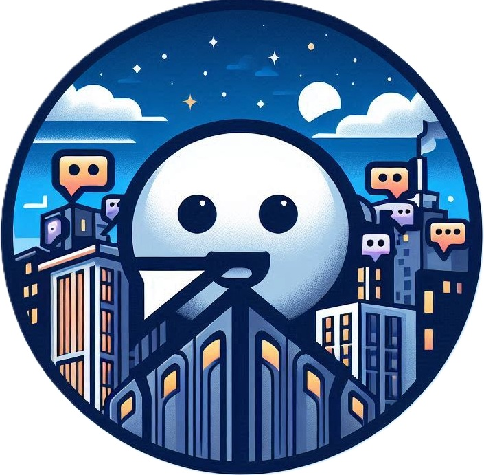

# MumbleMates

## Description
MumbleMates is a Peer 2 Peer Chat written in GO

## Technical Documentation

The documentation is automatically created when changes are merged and are uploaded as artifacts.
The latest version is also available under the latest Github Action: [📄 Technical Documentation](https://github.com/TIATIP-24-A-a/MumbleMates/actions/workflows/technical-docs.yml?query=branch%3Amain+is%3Asuccess)